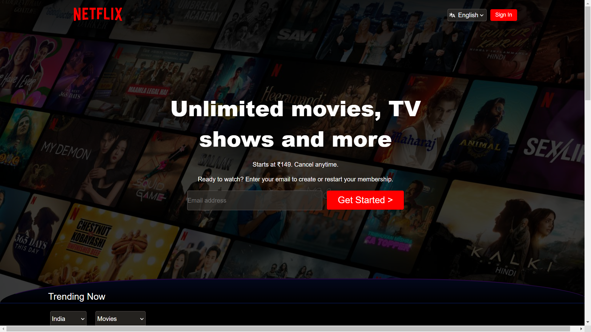

# Netflix Home Page Frontend

This repository contains the frontend of the Netflix home page, created using HTML and CSS. The project aims to replicate the layout and design of the Netflix home page to showcase web development skills.

## Website Live at: https://aryankitj.github.io/Netflix-Clone-2024/

## Table of Contents
- [Features](#features)
- [Technologies Used](#technologies-used)
- [Installation](#installation)
- [Usage](#usage)
- [Screenshots](#screenshots)

## Features
- **Navigation Bar**: A static navigation bar mimicking the Netflix design.
- **Content Sections**: Sections for featured content, movie thumbnails, and more.
- **Styling**: CSS styling to replicate Netflix's visual appearance.

## To Do
- will make me Responsive for All Devices.
- will change that weird curve (Above Trending)

## Technologies Used
- **HTML5**: For creating the structure of the web page.
- **CSS3**: For styling and layout.

## Installation
To view the project locally, follow these steps:

1. Clone the repository:
    ```bash
    git clone https://github.com/your-username/netflix-homepage-frontend.git
    ```

2. Navigate to the project directory:
    ```bash
    cd netflix-homepage-frontend
    ```

3. Open `index.html` in your preferred web browser to view the page.

## Usage
- Open the `index.html` file in any web browser to view the Netflix home page layout.
- You can modify the `index.html` and `styles.css` files to make customizations.

## Screenshots

